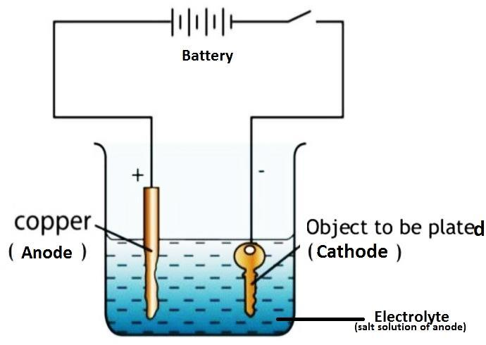
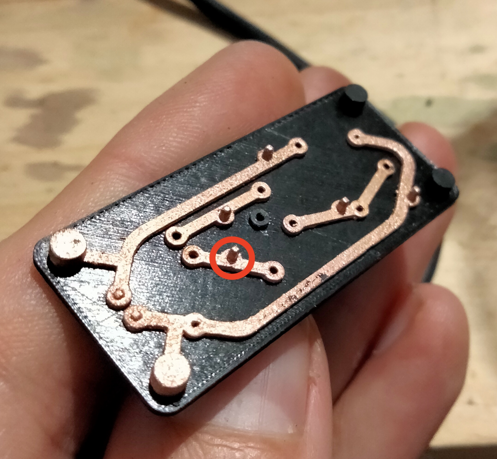
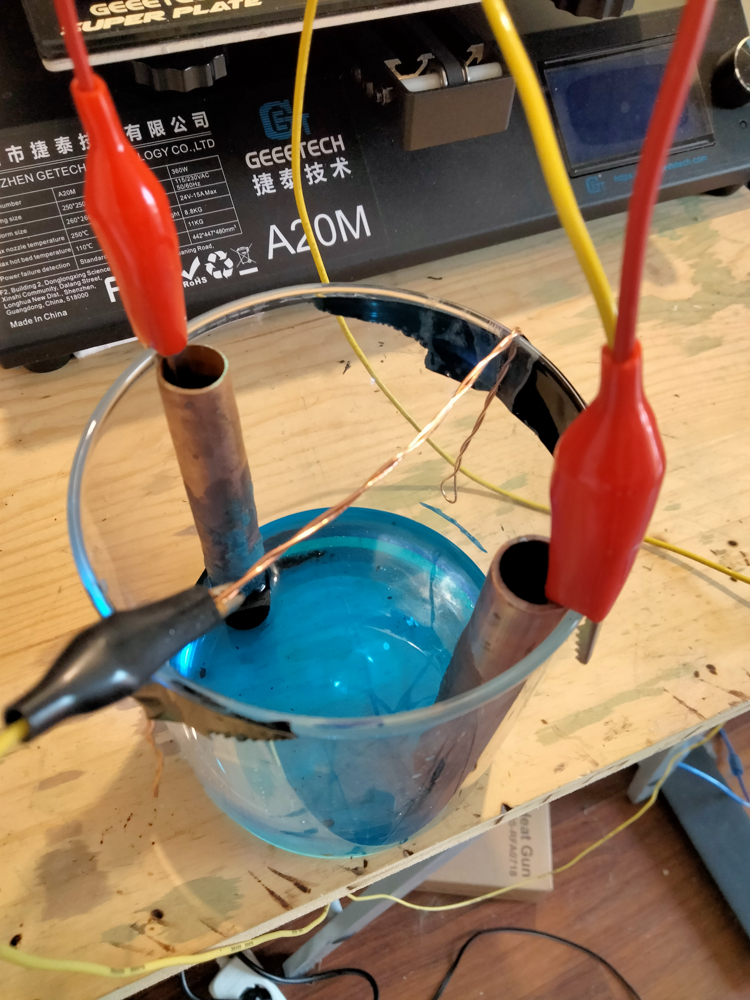
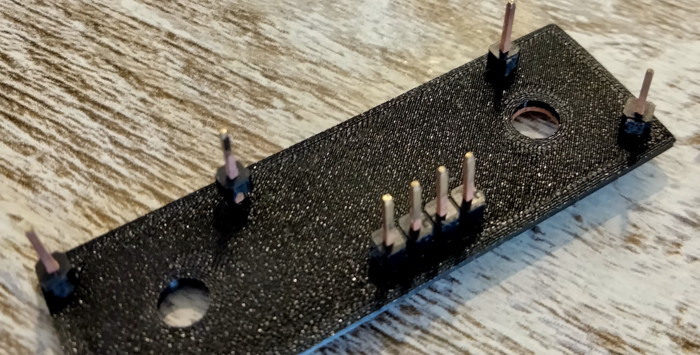

# Electroplating Process

One of the key primitives being developed by ProjectQuine is the ability to electroplate multi-material 3D printed parts. Being able to selectively augment parts of a 3D print with metal allows us to create usable printed circuit boards as well as more rigid or heat-resistant mechanical parts. This repo serves as a central place to document the process.

The following process is currently capable of producing quite usable printed circuit boards:

    

## Hardware setup

You will need the following hardware:
- 3D printer. Preferably with a 0.2mm nozzle if you want to print small and accurate PCBs.
- [Proto-pasta conductive filament](https://www.proto-pasta.com/collections/all/products/conductive-pla), or similar conductive filament.
- A generic non-conductive PLA filament.
- A variable power supply unit (PSU) that can function as a constant current or constant voltage source. Something like [this one](https://www.amazon.com/Adjustable-HANMATEK-HM305-Variable-Switching/dp/B0852JZQZR?th=1)
- Copper piping, about 15mm in diameter. You should be able to pick this up at most hardware stores.
- Large Crocodile clips.
- A sulpuric-acid based electrolyte copper plating solution. During our testing, we used [Dr. Galva's Bright copper electrolyte](https://www.drgalva.com/Glanzkupferelektrolyt-sauer) but we believe most commercially available solutions are suitable.
- [Jumper wires](https://www.adafruit.com/product/1954) and [0.1" header pins](https://www.adafruit.com/product/392)
- A glass jar about 100mm or so in diameter. 
- latex gloves (or similar) for handling the electrolyte solution.
- Some kind of stiff wire, it doesn't need to be conductive. We will just use this to create a bar across our bath to secure pieces to.
- A small model of a printed circuit board. To start with you can use our test model here: https://www.prusaprinters.org/prints/88763-simple-flashing-printed-circuit

First we need to setup the plating bath. We roughly want to follow the below diagram:

    

For our anode, we will cut two sections of copper piping, measure them to be about the length of our glass jar. You can then secure them to the side of the jar with the large croc clips. Wire the two copper croc clips together and connect them to the positive terminal of the PSU.

The 3D printed part will be our cathode. The setup for this will change depending on the circuit you are printing, but for demonstration purposes we will use our [simple flashing printed circuit board](https://www.prusaprinters.org/prints/88763-simple-flashing-printed-circuit). You will notice in the photo below that there are a number of functional through holes, and then there are a number of holes with pins plated in place. I call these plating rivets and they are added to the circuit model specifically for plating. To create the cathode, we push a number of 0.1" header pins into the plating rivet holes and connect the jumper wires to the pins. The other end of the jumper wires need to all be connected up to the negative terminal of the PSU. 

    

Finally, use a section of stiff wire to create a bar across the mouth of the glass jar and secure it with tape either side. We can now add about 250ml of electrolyte solution to the glass jar. Make sure that at least 20mm or so of the copper piping is submerged. Make sure to always use gloves when working with the acidic solution. Trust me you don't want to rub this stuff in your eyes later in the day. The final setup will look like something like this:

    

## Printing the part

With our plating bath all setup, we need to print some circuits to plate. We do this by creating a multi-material print. There are a number of different ways to do this, but since we currently only have a single nozzle, we slice the model with a pause at the layer where we start printing the circuit traces. When the printer pauses we simply swap the generic PLA for our fancy proto-pasta conductive filament and resume printing. There are obvious limitations to this approach, but it is a good starting point and gives us quite usable prints. 

In PrusaSlicer we do this by moving the layer height slider on the right hand side to the very first layer where the traces start being printed. We then right click the little "+" next to our slider and select "Add custome G-code". For our printer running klipper we just add the `PAUSE` macro which directs the printer to pause and move to a docked position. It's a good idea to make a note of the layer number where this macro is added, so that you can make sure to be around the printer when the pause happens and swap the filaments.

Our printer setup is the [Voron Switchwire](https://vorondesign.com/voron_switchwire) running [Klipper](https://www.klipper3d.org/). All our test prints were done with a 0.2mm nozzle, 0.1mm layer height, 100% infill and 3 vertical shells.  

## Plating the part

Once you have a printed part, you need to carefully insert the 0.1" header pins into the plating rivet holes from the underside of the print (the side that was directly on the print bed). The pins should be a very snug pressfit and the tip of the pin should protrude from a millimeter or so from the surface of the trace.

    

You can now connect up all the jumper wires to the pins. Once the pins are all in and we are happy the piece is secure, we can pop it into the plating solution. We want the circuit traces to be facing down towards the bottom of the glass jar. The whole model should be in the center of the jar and just a millimeter or so under the surface of the solution. One thing to beware of is that bubbles will form around the circuit trace. To counteract this, you need to give the piece a vigorous shake while submerged in the solution.

Before we power up the PSU, make sure the cathode/printed part is not connected. We first want to set the voltage and current correctly. There are a number of ways to do this, but what we have found to be the most reliable is to set a current limit. Roughly, we want to set our current to be about 0.15mA per square millimeter of the printed part. So for our test PCB print which is ~200mm^2 we cap our current at 30mA. To set the current limit, short the postive and negative terminals of the PSU, the current control indicator LED should light up. Then, set the appropriate current limit by moving the current dial. The voltage you set is not super important, you will find when the current is capped the voltage will drop to about 0.1 or 0.2V.

With the current limit set, we can now power up the PSU. The PSU should be in current control mode, if it's not, then it means you have either over estimated the current you need or you don't have a good connection on your cathode. When you first start the plating, visually inspect the underside of the circuit around the plating rivet pins, if you see tiny bubbles or a dark sooty area, then your current is way to high and you need to dial it down.

It's now just a matter of waiting. For our test PCB it should plate in about 9 hours or so. With electroplating, its best to go slow and steady. If you go too fast, with a higher current you may find you get a very rough finish or even worse, you may find the copper just clumps up near the pins. 

## Create your printable circuit

In order to print a circuit, we need to get our design into something the 3D printer understands. Our current approach to this is a bit manual at the moment, but we will be working on a better approach soon. The basic idea is that you take the copper layer of an existing PCB design and export it to SVG. This is pretty [straight forward in kicad](https://hacmanchester.github.io/LaserCutter.PCB.Making/KiCad/KiCad-ExportSvg/) but you will need to figure this out for your preferred PCB design software. Once you have the SVG file, you simply need to import it into fusion 360 as a SVG in your sketch.

With the bones of your copper layer imported into your 3D modelling software, we need to extrude all the traces. We have found that a trace height of about 0.5mm and width of 1mm works well. It is also a good idea to check clearances at this point. We have found that you don't want to go much lower than 0.3mm clearance distance between traces. Anything smaller than that you will find that plating starts to bridge between traces. Its also difficult to print with that much accuracy :)

Once you have all the traces setup, you need to add a base board to form the non-conductive part of our circuit board. For our tests board we created a base board with a 1mm height. This allows enough of the 0.1" header pin to protrude from the surface of the trace during plating. If you want to make a thicker base, you will need to use longer rivet pins to make contact with the traces.

Finally, you need to define the plating rivet holes. For our test PCB, these are defined with a 1mm diameter, but you can also do them at 0.8mm for a snugger fit. One of the difficult parts of this process is deciding on the placement of these holes. From a our experiments, a single pin can plate up to 40mm of a length of trace, assuming 1mm width and 0.5mm height. So when placing holes try make sure that every part of the circuit is with in 40mm from a plating hole.

With all of that you should have a model that is print and plate ready. It might take some experimentation and iteration to get the perfect setup for your circuit. Hopefully as this project progresses we will develop a more automated approach to generating the models.